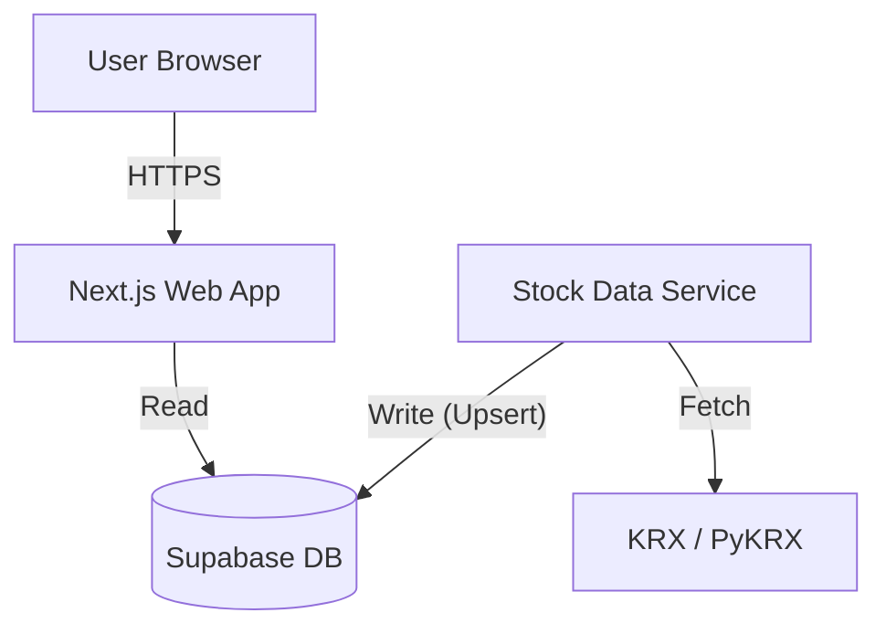

# DailyPort Deployment Guide

DailyPort now consists of two main components:
1.  **Web Client (Frontend/BFF)**: A Next.js application that serves the UI and reads data from Supabase.
2.  **Stock Data Service (Backend)**: A Python microservice that fetches market data (KRX, etc.) and synchronizes it to Supabase.

## Architecture



## Prerequisites

- **Node.js**: v18 or higher (for Next.js)
- **Conda**: Miniconda or Anaconda (for Python environment management)
- **Supabase**: A project with `analysis_cache` table.

## Local Development Setup

### 1. Database Setup (Supabase)
Ensure your `.env.local` contains:
```env
NEXT_PUBLIC_SUPABASE_URL=your_url
NEXT_PUBLIC_SUPABASE_ANON_KEY=your_anon_key
SUPABASE_SERVICE_ROLE_KEY=your_service_role_key
```

### 2. Frontend Setup (Next.js)
Navigate to the root directory:
```bash
npm install
npm run dev
```
The web app will run on `http://localhost:3000`.

### 3. Data Service Setup (Python)
Navigate to the `stock-data-service` directory:

1.  **Create Conda Environment**:
    ```bash
    cd stock-data-service
    conda env create -f environment.yml
    ```

2.  **Configure Environment**:
    Create a `.env` file in `stock-data-service/` (or ensure it can read the root `.env.local` which must contain `SUPABASE_SERVICE_ROLE_KEY` or `NEXT_PUBLIC_SUPABASE_ANON_KEY`).
    *Note: The script currently supports using the ANON key for upserts.*

3.  **Run the Service**:
    Activate usage of the conda environment.
    ```bash
    conda activate stock-data-service
    python main.py 005930.KS  # Sync a specific stock
    ```

## Production Deployment

### 1. Web App (Next.js)
- Deploy to **Vercel** (recommended) or any Node.js hosting.
- Set environment variables (`NEXT_PUBLIC_SUPABASE_URL`, `NEXT_PUBLIC_SUPABASE_ANON_KEY`) in the Vercel dashboard.

### 2. Data Service (Python)
Since this requires a Python runtime and scheduled execution:
- **Option A: VPS / VM (EC2, DigitalOcean)**
    - Clone the repo.
    - Setup Conda environment.
    - Use `crontab` (Linux) or Task Scheduler (Windows) to run `python main.py` periodically (e.g., daily at 16:00 KST).
- **Option B: Cloud Functions (AWS Lambda / Google Cloud Functions)**
    - Package the script as a container image or zip with dependencies.
    - Trigger via Cloud Scheduler.
- **Option C: GitHub Actions (For simple daily syncs)**
    - Configure a workflow to checkout, setup python, and run the script daily.

**Important**: The Web App does **not** run the Python script. The Python script must run independently to populate the database.
