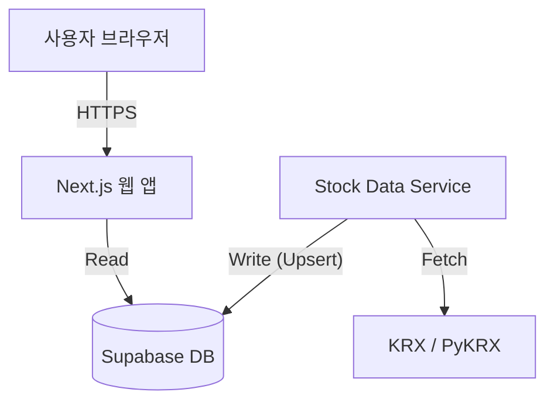

# DailyPort 배포 및 운영 가이드

DailyPort는 두 가지 주요 컴포넌트로 구성되어 있습니다:

1.  **Web Client (Frontend/BFF)**: UI를 제공하고 Supabase에서 데이터를 읽어오는 Next.js 애플리케이션입니다.
2.  **Stock Data Service (Backend)**: 시장 데이터(KRX 등)를 수집하여 Supabase와 동기화하는 Python 마이크로서비스입니다.

## 아키텍처 (Architecture)



## 사전 요구사항 (Prerequisites)

-   **Node.js**: v18 이상 (Next.js 실행용)
-   **Conda**: Miniconda 또는 Anaconda (Python 환경 관리용)
-   **Supabase**: `analysis_cache` 테이블이 생성된 Supabase 프로젝트

---

## 로컬 개발 환경 설정 (Local Development Setup)

### 1. 데이터베이스 설정 (Supabase)
`.env.local` 파일에 다음 내용이 포함되어 있는지 확인하세요:
```env
NEXT_PUBLIC_SUPABASE_URL=your_url
NEXT_PUBLIC_SUPABASE_ANON_KEY=your_anon_key
SUPABASE_SERVICE_ROLE_KEY=your_service_role_key
```

### 2. 프론트엔드 설정 (Next.js)
루트 디렉토리에서 다음 명령어를 실행하세요:
```bash
npm install
npm run dev
```
웹 애플리케이션은 `http://localhost:3000`에서 실행됩니다.

### 3. 데이터 서비스 설정 (Python)
`stock-data-service` 디렉토리로 이동하여 다음을 수행합니다:

1.  **Conda 환경 생성**:
    ```bash
    cd stock-data-service
    conda env create -f environment.yml
    ```

2.  **환경 변수 설정**:
    `stock-data-service/` 내부에 `.env` 파일을 생성하거나, 루트의 `.env.local` 파일이 읽힐 수 있는지 확인하세요. (`SUPABASE_SERVICE_ROLE_KEY` 또는 `NEXT_PUBLIC_SUPABASE_ANON_KEY` 필수)

3.  **서비스 실행**:
    Conda 환경을 활성화한 후 실행합니다.
    ```bash
    conda activate stock-data-service
    python main.py 005930.KS  # 특정 종목 동기화 테스트
    ```

---

## Stock Data Service 상세 가이드

## Stock Data Service 상세 및 관리 (Admin Tools)

Stock Data Service는 `admin-tools/stock-data-service/` 디렉토리로 이동되었습니다.

> **[주의] 로컬 개발 환경의 차이점**
> *   **로컬 (`npm run dev`)**: Next.js 서버만 실행되므로, `/api/stock-sync` 주소로 요청해도 Python 스크립트가 실행되지 않습니다. (404 에러)
> *   **배포 환경 (Vercel)**: Vercel이 Python 런타임을 함께 띄워주므로 `/api/stock-sync` 호출 시 Python이 실행됩니다.
> *   **해결책**: 로컬에서는 웹 앱이 Python을 자동 호출할 수 없으므로, **Admin Tools (배치 파일)**를 사용하여 수동으로 데이터를 갱신해야 합니다.

### 1. 주요 관리 스크립트

관리 편의를 위해 `admin-tools` 폴더 내에 배치 파일(`*.bat`)과 Node.js 래퍼가 준비되어 있습니다.

**A. 종목 리스트 생성 (Update Stock List)**
`src/data/stocks.json` 파일을 최신 상태(KRX 기준)로 갱신합니다.
*   **실행**: `admin-tools/1_update_list.bat` 클릭
*   **CLI**: `node admin-tools/update-stock-list.js`

**B. 전체 가격 동기화 (Sync All Prices)**
전체 종목의 가격 및 수급 데이터를 갱신하여 DB에 저장합니다. (시간이 오래 걸릴 수 있음)
*   **실행**: `admin-tools/2_sync_prices.bat` 클릭
*   **CLI**: `node admin-tools/sync-stocks.js`

### 4. 데이터 저장 (Supabase Upsert)

수집된 데이터는 Supabase의 `analysis_cache` 테이블에 JSON 형태로 저장됩니다.
*   **Table**: `analysis_cache`
*   **Columns**:
    *   `ticker`: 종목 코드 (Primary Key)
    *   `data`: 수집된 전체 데이터 (JSONB)
    *   `generated_at`: 데이터 생성 시각
    *   `source`: 데이터 소스 식별자 ("PYKRX_SERVICE")

---

## 프로덕션 배포 (Production Deployment)

### 1. 웹 앱 (Next.js)
-   **Vercel** 배포를 권장합니다.
-   Vercel 대시보드에서 `NEXT_PUBLIC_SUPABASE_URL`, `NEXT_PUBLIC_SUPABASE_ANON_KEY` 환경 변수를 설정하세요.

### 2. Stock Data Service (서버리스 배포 - Vercel)
DailyPort의 Stock Data Service는 Vercel의 Serverless Function(Python Runtime)으로 완벽하게 동작합니다.

**작동 원리**:
*   Next.js 웹 앱과 Python 서비스가 하나의 Vercel 프로젝트로 배포됩니다.
*   `/api/stock-sync` 엔드포인트를 호출하면 `stock-data-service/main.py`의 `handler` 함수가 실행됩니다.

#### [단계별 설정 가이드]

**Step 1. 설정 파일 확인 (`vercel.json`)**
루트 디렉토리에 `vercel.json` 파일이 이미 생성되어 있습니다. 이 파일은 `/api/stock-sync` 요청을 Python 스크립트로 연결합니다.
```json
{
  "rewrites": [
    { "source": "/api/stock-sync", "destination": "/stock-data-service/main.py" }
  ],
  "functions": {
    "stock-data-service/main.py": {
      "maxDuration": 60,
      "runtime": "python3.11" 
    }
  }
}
```

**Step 2. 필수 파일 확인**
*   `stock-data-service/requirements.txt`: Python 의존성 파일이 있어야 합니다. (자동 생성됨)
*   `stock-data-service/main.py`: Vercel이 호출할 `handler(request)` 함수가 포함되어 있어야 합니다. (이미 포함됨)

**Step 3. Vercel 배포 및 환경변수 설정**

1.  **Vercel CLI 설치 (로컬 테스트용, 선택사항)**
    ```bash
    npm i -g vercel
    vercel login
    ```

2.  **배포 (또는 GitHub 연동)**
    GitHub에 코드를 푸시하고 Vercel 대시보드에서 레포지토리를 연결하면 자동으로 배포가 시작됩니다.

3.  **환경 변수 설정 (중요)**
    Vercel 대시보드 > Project Settings > Environment Variables 메뉴에서 다음 키를 추가해야 Python 서비스가 DB에 접근할 수 있습니다.
    *   `NEXT_PUBLIC_SUPABASE_URL`: (Supabase Project URL)
    *   `NEXT_PUBLIC_SUPABASE_ANON_KEY`: (Supabase Data API Key)
    *   `SUPABASE_SERVICE_ROLE_KEY`: (선택, Admin 권한 필요 시)

**Step 4. 실행 및 테스트**
배포가 완료되면 브라우저나 HTTP 클라이언트로 테스트합니다.

*   **단일 종목 동기화**:
    `https://your-project.vercel.app/api/stock-sync?ticker=005930.KS`
*   **결과 확인**:
    성공 시 `{"status": "success", "data": {...}}` 응답이 오며 Supabase 데이터베이스가 갱신됩니다.

**Step 5. (선택사항) 자동 업데이트 설정 (Vercel Cron)**
매일 특정 시간에 주요 종목을 업데이트하려면 `vercel.json`에 `crons` 설정을 추가할 수 있습니다.
```json
// vercel.json 예시
{
  "crons": [
    {
      "path": "/api/stock-sync?ticker=005930.KS",
      "schedule": "0 16 * * 1-5"
    }
  ]
   // ... 기존 설정 유지
}
```
*주의: Vercel Hobby 플랜은 Cron 작업 개수에 제한이 있을 수 있습니다.*

---

### 3. Data Service (서버 / 데몬 배포 - 대역폭 집중형)
실시간성이나 전체 종목의 안정적인 동기화가 중요하다면 VPS나 로컬 서버에서 데몬 모드로 실행하는 것을 권장합니다.

*   **옵션 A: VPS / VM (EC2, DigitalOcean 등)** (가장 일반적)
    1.  서버에 레포지토리를 클론(Clone)합니다.
    2.  `environment.yml`을 사용하여 Conda 환경을 구축합니다.
    3.  `crontab` 등 스케줄러를 등록하거나, `run_service_daemon.bat`와 같이 무한 루프로 실행합니다.

---

## [중요] 실행 모델 비교 (Execution Models)

사용하려는 목적에 따라 적절한 배포 방식을 선택해야 합니다.

| 특징 | **데몬 모드 (Daemon/Loop)** | **API 서버리스 모드 (Vercel)** |
| :--- | :--- | :--- |
| **작동 방식** | 프로그램이 계속 켜져 있음 (메모리 상주) | 요청이 올 때만 잠시 켜졌다가 꺼짐 |
| **데이터 갱신** | `while True` 루프를 통해 스스로 계속 갱신 | 누군가(User/Cron)가 호출해야 갱신됨 |
| **처리량** | 전체 종목(2000+) 순차적 무한 동기화 가능 | **한 번에 1개 종목** 동기화 권장 (시간 제한 때문) |
| **비유** | "스스로 움직이는 로봇 청소기" | "버튼을 눌러야 작동하는 믹서기" |
| **추천 상황** | **전체 데이터**를 항상 최신으로 유지해야 할 때 | **비용 절감**이 중요하거나, 필요한 종목만 그때그때 갱신할 때 |

> **선생님의 질문에 대한 답변**:
> Vercel 배포 방식은 **"한 번에 하나씩(또는 요청받은 만큼만)"** 실행되는 것이 맞습니다.
> 스스로 계속 도는 것이 아니므로, 전체 종목을 다 갱신하려면 Vercel Cron으로 수백 번 요청을 보내거나, 사용자가 조회할 때마다 해당 종목을 업데이트하는 방식(On-Demand)을 사용해야 합니다.

---

## 주요 파일 및 구성
    1.  서버에 레포지토리를 클론(Clone)합니다.
    2.  `environment.yml`을 사용하여 Conda 환경을 구축합니다.
    3.  `crontab` (Linux) 또는 작업 스케줄러 (Windows)를 사용하여 주기적으로 실행합니다.
        *   예: 매일 장 마감 후 16:00에 실행
        *   `0 16 * * 1-5 /path/to/conda/python /path/to/project/stock-data-service/main.py --sync-all`

*   **옵션 B: GitHub Actions** (간단한 하루 1회 실행용)
    -   GitHub Actions 워크플로우를 작성하여 매일 특정 시간에 가상 환경을 띄우고 스크립트를 실행하도록 설정할 수 있습니다.

**중요**: 웹 앱(Next.js) 자체가 Python 스크립트를 실행하지 **않습니다**. 웹 앱은 Supabase에 저장된 데이터를 읽기만 하며, Python 서비스가 독립적으로 실행되어 데이터를 채워 넣어야 합니다.
